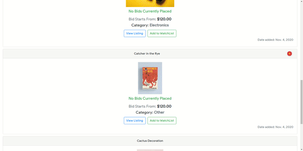
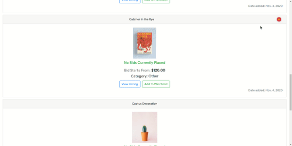
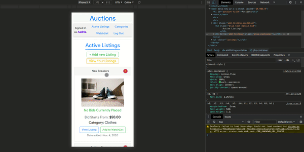

# Auction - Django Web App

### Requirements
- `Python3.6 frameworks/packages` :
  - `Django`
  - `Pillow`
- `Browser` (Preferably `Chrome`)

### Setup
- Clone the repo using `git clone https://github.com/Aadhieaswar/auction-web-app.git`
- Using a Python virtual environment recommended
- If you have `Python` installed but not `Django` or `Pillow`:
  - run `pip3 install django pillow`
- To run the website in a development server:
  - `cd` into the repo and run `python3 manage.py runserver`

### Additional Setup
- To create a super user for the website simply run:
  - `python3 manage.py createsuperuser`
- Then, enter credentials such as username, email and password for the account
- After running the website in a local port (Django defaults to port 8000) using `python3 manage.py runserver`:
  - Visit `localhost:8000/admin` and login with the credentials created earlier
  - Upon logging in successfully, you should be able to access the __django admin interface__

### Files and Directories
- The crucial files in the repo home directory are:
  - `manage.py` : the python file required to run the website
  - `db.sqlite3`: the website uses `sqlite3` database which stores the data in this file
- The `auctions` directory has the files for the auction application which includes:
  - `views.py`: server side code for the website
  - `urls.py`: the urls that determine which associates url extensions to the views from `views.py` file
  - `models.py`: the tables needed for the `sqlite3` database
  - `decorators.py`: functions that add a layer of security concerning logged-in and logged-out users
  - `admin.py`: adds the database tables to be modified in the django admin interface
  - `forms.py`: to create forms for easier access of `POST` data from the `HTML` forms
  - `templates` directory: consists of all the `HTML` files to be rendered
  - `static` directory: consists of files such as `CSS` and images used in the web page
  - `uploads` directory: consists of images from the ImageField in the database table
- The `commerce` directory has the files for crucial for the functions of the auction application which includes:
  - `settings.py`: consists of all the settings for the whole web application
  - `urls.py`: the main urls file with the urls from all the apps in the web application (such as auctions)
- The `images` directory holds many pictures that show you the look of the website

### Features of the Website
##### Create a new listing
  
   
Here, there was listing named **Nice Mug** created with initial bid of **$10**
  

##### Bid on listings
  
   
Here, there was a bid of **$30** put on the **Cactus Decoration** which had an initial bid of **$20**
  

##### Responsive
  
   
Here, multiple pages of the auction website are shown in the __IphoneX__ screen view
  

### Credits
- Harvard CS50 for this idea of a wonderful project.
- Implemented by __Aadhieaswar Senthil Kumar__
  - Contact me at: <aadhieaswar@gmail.com>
